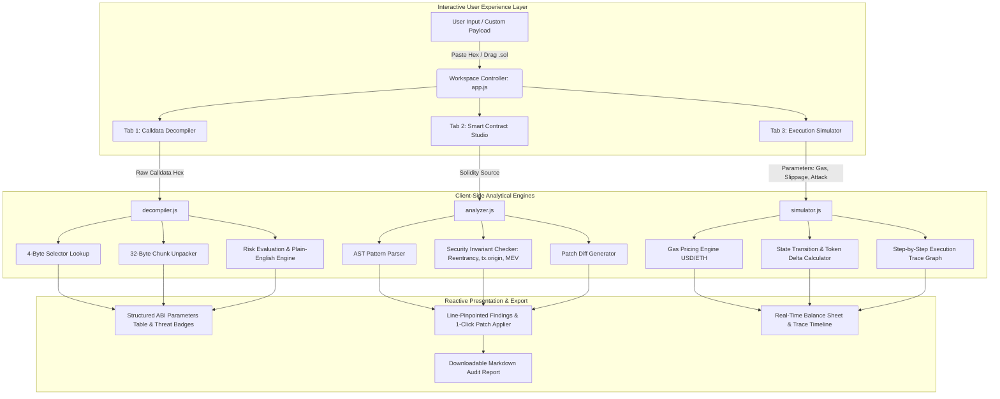

# System Architecture Document
## TxGuard Studio: Interactive Web3 Transaction Decompiler & Smart Contract Security Studio

### 1. High-Level Architectural Flow

---

### 2. Component Design & Responsibilities

| Component | Technology | Responsibility |
| :--- | :--- | :--- |
| **`index.html`** | HTML5 / Tailwind | Core single-page interface with tabbed workspace, modal-free workflows, and responsive layouts. |
| **`app.js`** | Vanilla ES6+ | Master reactive state controller; synchronizes DOM updates, event listeners, and user inputs. |
| **`decompiler.js`** | JavaScript / BigInt | Dissects EVM calldata, verifies hex integrity, unpacks ABI encodings, and identifies phishing vectors. |
| **`analyzer.js`** | JavaScript Regex / AST | Evaluates Solidity source code against 5 core invariant violation rules and computes security scores. |
| **`simulator.js`** | JavaScript Math Engine | Calculates dynamic gas economics, token exchange ratios, slippage bounds, and attack scenarios. |
| **`templates.js`** | JavaScript JSON | Curates benchmark test cases (USDC approve, EIP-2612 permit, The DAO reentrancy, MEV sandwich). |
| **`studio.css`** | CSS3 | Obsidian theme, luxury typography (`JetBrains Mono`, `Plus Jakarta Sans`), and glow tokens. |
| **`txguard_core.py`** | Python 3.14 | Standalone backend CLI and automated headless verification suite. |

---

### 3. Security Invariant Checking Engine

The static analyzer evaluates code against five critical Web3 invariant vulnerabilities:

1. **Checks-Effects-Interactions (CEI)**:
   $$\text{State Mutation} \prec \text{External Value Transfer}$$
   Ensures that contract balances are zeroed or updated before invoking untrusted `call{value: ...}`.
2. **Access Control Integrity**:
   $$\text{msg.sender} \equiv \text{Authorized Signer} \quad (\text{reject } \text{tx.origin})$$
   Guarantees that intermediate phishing contracts cannot hijack authority.
3. **Safe ERC-20 Transfer Compliance**:
   Ensures that tokens without standard boolean return types (such as Tether USD) are wrapped with `SafeERC20.safeTransfer`.
4. **MEV & Frontrunning Protection**:
   $$\text{amountOutMin} > 0 \quad (\text{reject } \text{zero slippage})$$
   Guarantees that decentralized exchange swaps cannot be drained by sandwich searchers.
5. **Zero-Address Guards**:
   Verifies that administrative or recipient addresses validate `newAddress != address(0)`.
